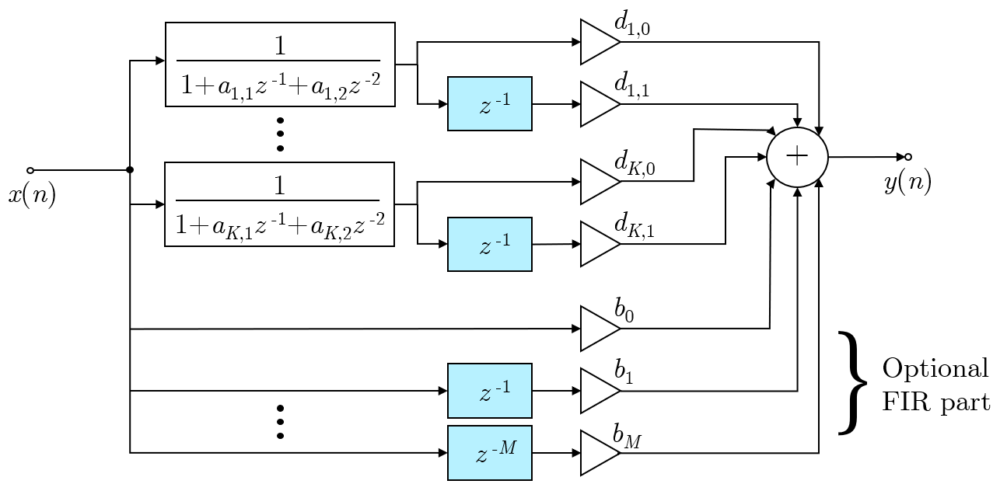
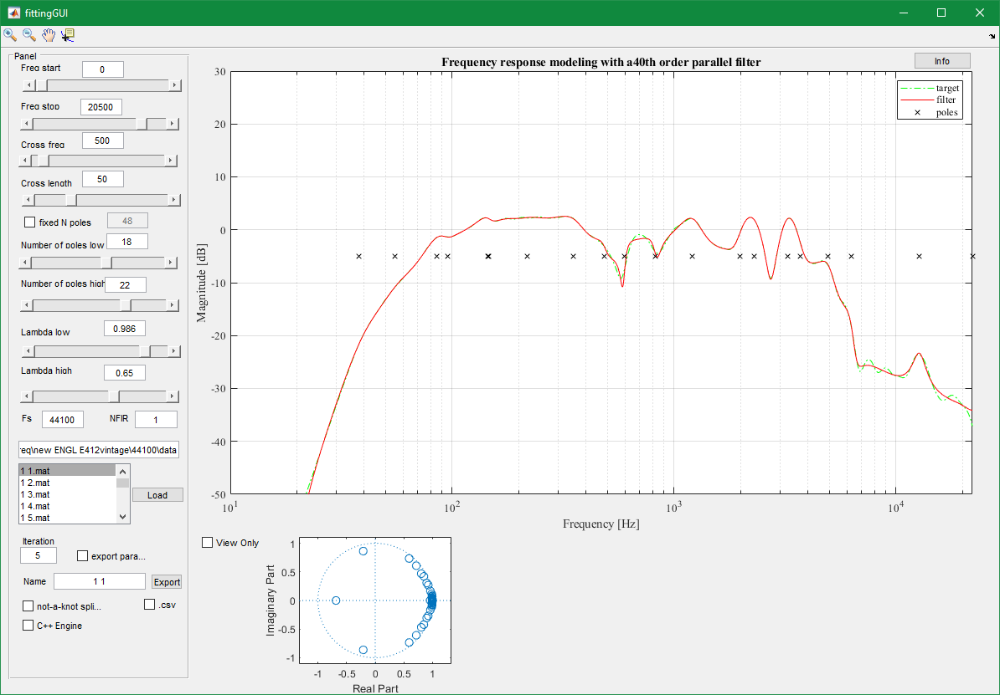
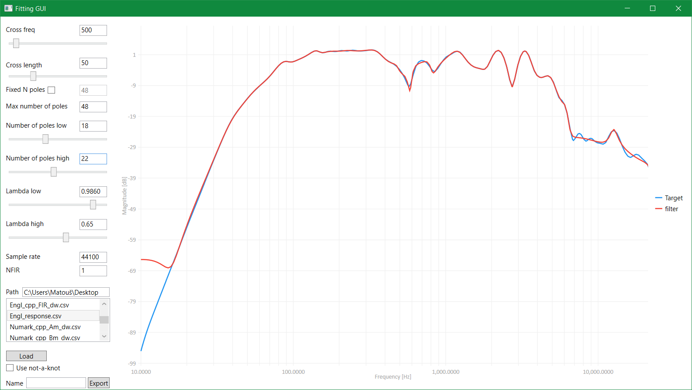
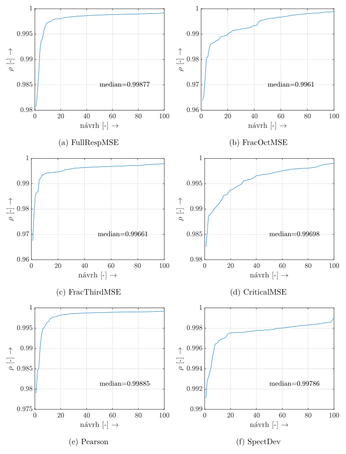
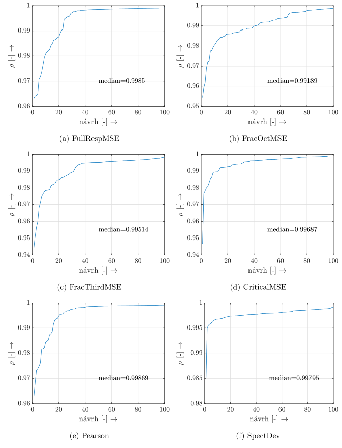
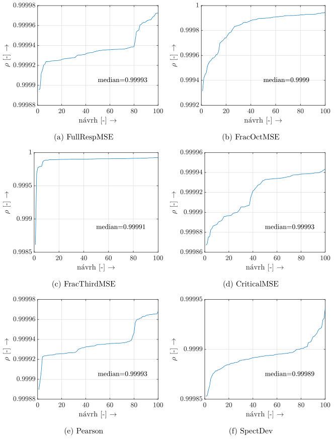
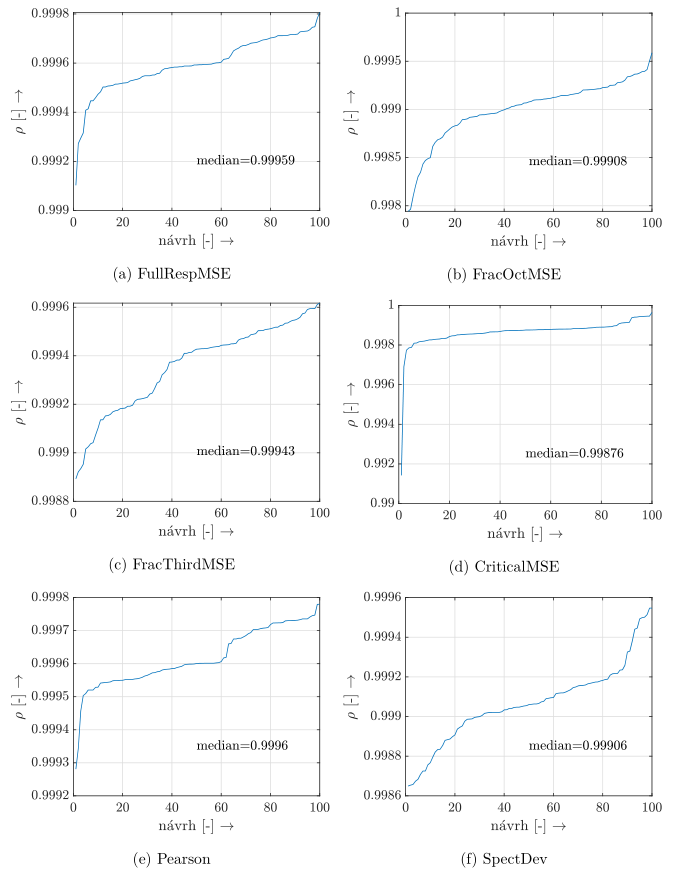

# Modeling of Linear Distortion of Audio Devices
This is my Master's Thesis at [BUT - Brno University of Technology](https://www.vutbr.cz/en/ "BUT - Brno University of Technology").

* **University:** Brno University of Technology, Czech Republic
* **Faculty:** Faculty of Electrical Engineering and Communication, Department of Telecomunications
* **Field of Study:** Audio Engineering
* **Supervisor:** doc. Ing. Jiří Schimmel, Ph.D.
* **Author:** Bc. Matouš Vrbík

---
## About

This paper focuses on modeling desired frequency response by digital filter. Structure of parallel second-order sections with additional FIR part is used as filter structure.

  

This structure is capable of modeling desired frequency response as well as designing a compensating equaliser to flatten the frequency response. Poles of the filter are calculated by combination of *pseudocorrelation* Kallman's method [[1]](/README.md#Citations) and Steiglitz-McBride method if frequency domain [[2]](/README.md#Citations). Then zeros of parallel sections are calculated.

You may find the structure filter familiar, as it is true. This field has been studied by Assoc. Prof. Balázs Bank, you can visit [his page](http://home.mit.bme.hu/~bank/parfilt/) [[3]](/README.md#Citations), where you may find more information about parallel filters, as well as some MATLAB scripts demonstrating the calculation process.

---
Second part of this paper specializes on automatic calculation of parameters used for filter design. Out of several methods, *dual warping* is selected as the most flexible and precise method. On the other hand it, has more parameters to be optimized. The method works in 2 separate frequency bands, each in warped frequency domain [[4]](/README.md#Citations). Parameters are

- Number of low frequency poles.
- Number of high frequency poles.
- Lambda low.
- Lambda high.
- Cross frequency.
- Cross length.

These must be optimized for the best filter result. Chosen method [Particle Swarm Optimization](https://en.wikipedia.org/wiki/Particle_swarm_optimization) [[5]](/README.md#Citations) will perform the optimization task. PSO algorithm is implemented in MATLAB, calculating results within seconds. 

Several methods for evaluation of filter design precision (*fitness*) were proposed and utilized in PSO algorithm. You can see the results at the end of chapter 7 in the [paper](/Text/xvrbik00DP.pdf) or [here](/README.md#Results).

### Citations
[1] STEIGLITZ, K. and L.E.MCBRIDE. A Technique for the Identification of Linear Systems. *IEEE Transactions on Automatic Control*. 1965, **10**(4), 461–464.

[2] JACKSON, L.B. Frequency-domain Steiglitz-McBride method for least-squares IIR filter design, ARMA modeling, and periodogram smoothing. *IEEE Signal Processing Letters*. 2008, **15**, 49–52. ISSN 1070-9908.

[3]  BANK, Balázs. Transfer function modeling and equalization by fixed-pole parallel filters [online]. [cit. 2019-12-17]. Available at: http://home.mit.bme.hu/~bank/parfilt/.

[4] KARJALAINEN, M., A.HARMA, U.K.LAINE and J.HUOPANIEMI. Warped filters and their audio applications. Proceedings of 1997 Workshop on Applications of Signal Processing to Audio and Acoustics. IEEE, 1997, 4–. DOI:10.1109/ASPAA.1997.625615. ISBN 0-7803-3908-8. Available at: http://ieeexplore.ieee.org/document/625615/

[5] CLERC, Maurice. Standard Particle Swarm Optimisation. 2012. hal-00764996. Available at: https://hal.archives-ouvertes.fr/hal-00764996

---

## Provided files and algorithms
Based on Balázs Bank's MATLAB algorithms, same functionality has been implemented in C++ and Python. In the Output directory, you can find built applications for filter design by *dual warp* algorithm, with manually set parameters. You can use MATLAB or WPF C# application. MATLAB application provides use of MATLAB core algorithm and C++ core algorithm, WPF only supports C++ algorithm.

MATAB                      |  WPF C#
:-------------------------:|:-------------------------:
  |  

The core C++ algorithm is in [this](/C%2B%2B/ParallelFilters/ParallelFilters/ParallelFilterDesign.h) and linked header files. API for C# is in [this](/C%23/FittingGUI/ParFiltDesign.cs) file, the **ParFiltDllWrapper.dll** must be at the same location. 

Input file format is specific MAT file described in the application or CSV file. Output - the coefficients of the filter - are exported in CSV file.

### PSO
PSO algorithm is implemented in MATLAB, the scripts and results of analysis can be found at [MATLAB/PSO](/MATLAB/PSO) folder.

### Results
In the analysis for each fitness function used in PSO 100 filter designs were made and the precision finally compared by Pearson correlation coefficient (measure similarity between desired frequency response and filter response). Four target responses were chosen - Marshall, Engl guitar cabinets, Numark RedWave headphones and Škoda Fabia interior. Plotted results demonstrate ordered precision of filter design by Pearson correlation coefficient with median values displayed.

Engl                      |  Marshall
:-------------------------:|:-------------------------:
  |  

Numark                      |  Fabia
:-------------------------:|:-------------------------:
  |  

### Licence
All provided files and algorithms are under [CC BY-NC-SA 4.0](https://creativecommons.org/licenses/by-nc-sa/4.0/) licence, see [LICENSE file](/LICENSE).

### Utilized libraries
- [Cubic spline by Tino Kluge](https://github.com/ttk592/spline/)
- [Eigen](http://eigen.tuxfamily.org/)
- [Live Charts](https://lvcharts.net/)
- [Not a knot spline](https://github.com/TheMates/SplineNotAKnot)
- [Rapidcsv](https://github.com/d99kris/rapidcsv)
- [Simple-FFT](https://github.com/d1vanov/Simple-FFT)

 
